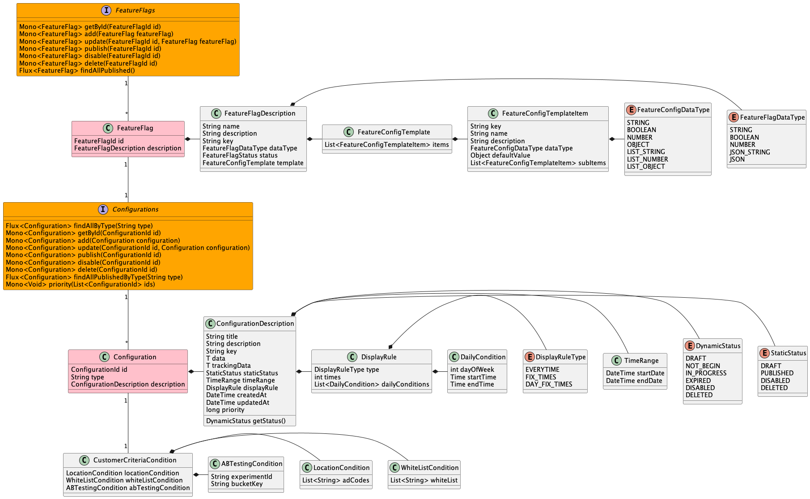
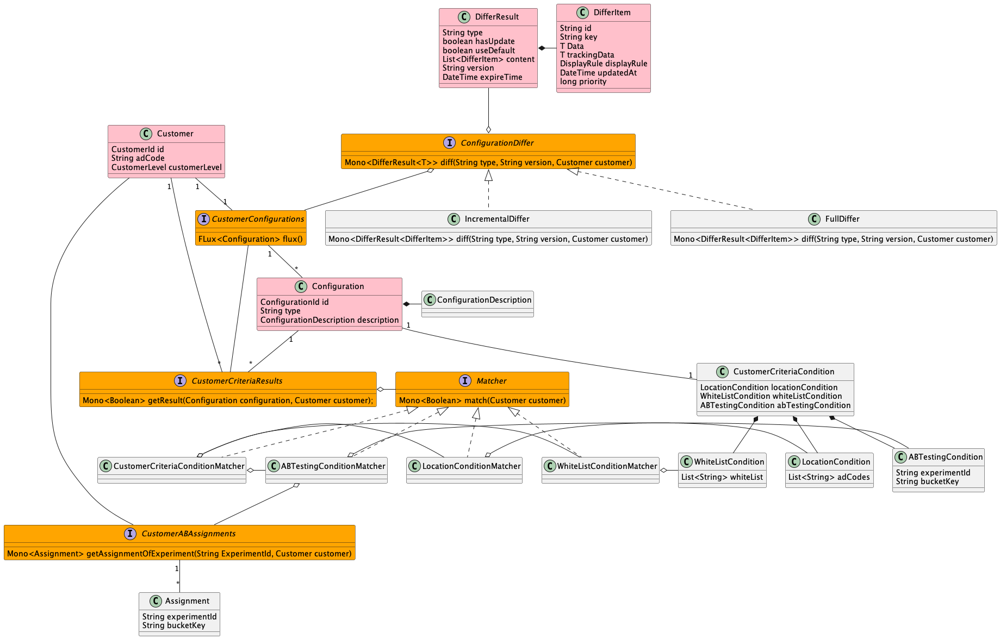

# 简介

该项目是一个提供了APP端动态配置，配置端和C端动态圈人能力的简化系统。

基于Smart Domain方法设计和开发。

# 技术栈
* Java 17
* Spring Web Flux
* RSocket
* Spring Data
* Couchbase
* caffeine

# 分层

- API层（api）： 提供对外API接口
- 领域模型层（domain）： 领域模型对象及抽象接口
  - 持久化层（persistence）：提供domain层抽象接口实现

    
# 模型




## 主要模型概念解释

- Configuration - 配置，支持不同业务场景（通过type区分场景），不同场景中的配置数据（data）结构可变
- CustomerCriteriaCondition - 圈人条件
  - WhiteListCondition - 白名单圈人条件（可改成远程接口调用从而支持动态白名单圈人）
  - LocationCondition - 地理位置圈人条件（基于省市区地理位置编码，例如西安-610100）
  - ABTestingCondition - AB测试分组圈人条件
- Configurations - 配置集合
- Customer - 客户端用户
- CustomerConfigurations - 用户可见配置集合
- CustomerCriteriaResults - 用户圈人圈人结果集合
- Matcher - 圈人条件解析器
  - WhiteListConditionMatcher - 白名单圈人条件解析器
  - LocationConditionMatcher - 地理位置圈人条件解析器
  - ABTestingConditionMatcher - AB测试圈人条件解析器
- ConfigurationDiffer - 结合app缓存能力提供按照数据版本返回有更新部分数据，基于CustomerConfigurations和数据版本计算更新结果
  - FullDiffer - 返回更新后的全量数据（有更新时APP端全量替换本地配置）
  - IncrementalDiffer - 返回更新的增量量数据（有更新时APP端增量替换本地配置）

# 运行命令

## 启动数据库

```shell
docker-compose up -d
``` 

第一次启动，访问 http://localhost:8091, 配置cluster 和 bucket

## 编译

```shell
./gradlew build
``` 

可执行jar目录 ./main/build/libs/main.jar

## Run

```shell
./gradlew bootRun
``` 

## RSocket命令行请求样例

```shell
> rsc --route=customer-configurations.diff --channel -m '{"customerId": "111","adCode":"610101","customerLevel":"VIP"}' --mmt application/json  --dmt application/json --data=- tcp://localhost:7001

> {"type":"FULL_TEST"}
{"type":"FULL_TEST","differResult":{"hasUpdate":false,"useDefault":false,"content":null,"version":null}}
> {"type":"INCR_TEST"}
{"type":"INCR_TEST","differResult":{"hasUpdate":false,"useDefault":false,"content":null,"version":null}}
```
